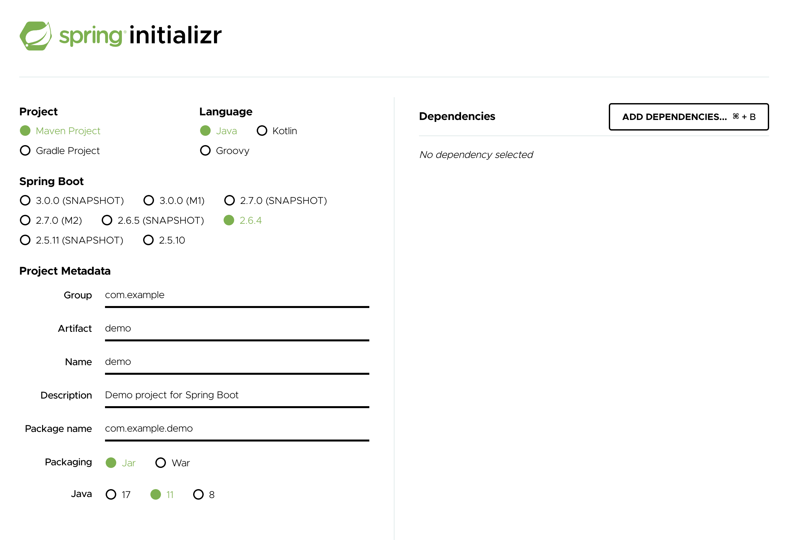

# Todo tutorial

환경  
> React 17  
> Spring Boot 2.6 (Java 8 or 11)  
> MariaDB  

다루지 않는 것들  
> React state management  
> 로그인/인증  
> Spring Custom Error  
> Spring Security  

프로젝트 디렉토리 구조는 아래와 같음

```
todo
├── backend
└── front
```

## Front

### 1. 개발환경

VSCode를 사용할 경우 아래 플러그인 사용하여 prettier를 사용한다

- Prettier - Code formatter
- Prettier ESLint


```json
"prettier.jsxSingleQuote": true,
"prettier.arrowParens": "avoid",
"prettier.singleQuote": true
"prettier.jsxBracketSameLine": true,
"eslint.format.enable": true,
"editor.formatOnSave": true,
```


### 2. 프로젝트 작성

```sh
$ npx create-react-app todo
$ cd todo
$ yarn start
```

yarn start 라고 입력하면 프론트 개발서버를 시작한다  
http://localhost:3000 으로 접속한다.


### 3. 패키지 설치

[Axios](https://axios-http.com)  
[Axios 한글사이트](https://axios-http.com/kr/docs/intro)

패키지를 설치하면 프론트 서버를 재시작 해야 한다  
```sh
$ yarn add axios
```

### 4. 환경 파일

아래의 파일을 작성하고 프론트에서 사용할 서버 주소를 환경변수로  
기술한다.

- .env.development
- .env.production

```
REACT_APP_API= /api/todo
```

### 5. 프록시 설정

_package.json_

```json
 "proxy": "http://localhost:8080"
```

### 6. 소스 구조


1. TodoAdd 폼을 이용하여 정보를 입력한다   
2. 정보는 hook를 통해 외부 서비스 api로 전달된다  
3. 결과는 TodoList에 반영된다.

---

## Backend

### 1. 프로젝트 작성

[Spring initialzr](https://start.spring.io) 를 통해서 프로토타입을
작성한다.



Project는 Maven 이나 Gradle 중 하나를 고른다.

> [ADD DEPENDENCIES] 버튼을 눌러서 아래의 의존성 을 추가한다.

- Lombok
- Spring Boot DevTools
- Spring Web
- Spring Data JPA
- Validation
- MariaDB Driver

> [GENERATE] 를 클릭 하여 최종적으로 프로젝트를 zip 파일로 다운로드 받는다.

### 2. API

|URL|Method| Reqeust| Response|
|:--|:--|:--|:--|
| /api/todo | GET | | Todo 배열 |
| /api/todo | POST | Todo | Todo |
| /api/todo/{id} | PUT|Todo | Todo|
| /api/todo/{id} | DELETE | - | -|


### 3. Entity

```java
package com.koreanair.todo.entity;

import lombok.Getter;
import lombok.NoArgsConstructor;
import lombok.Setter;

import javax.persistence.*;
import javax.validation.constraints.NotEmpty;

@Entity
@Table(name = "todo")
@Getter
@Setter
@NoArgsConstructor

public class Todo {

    @Id
    @GeneratedValue(strategy = GenerationType.IDENTITY)
    private Integer id;

    @Column
    @NotEmpty(message = "내용을 입력하세요")
    private String text;

    @Column
    private boolean done;
}
```

### 4. Repository

```java
package com.koreanair.todo.repository;

import com.koreanair.todo.entity.Todo;
import org.springframework.data.jpa.repository.JpaRepository;
import org.springframework.stereotype.Repository;

@Repository
public interface TodoRepository extends JpaRepository<Todo, Integer> {

}
```

### 5. Controller

```java
package com.koreanair.todo.controller;

import com.koreanair.todo.entity.Todo;
import com.koreanair.todo.repository.TodoRepository;
import org.springframework.beans.factory.annotation.Autowired;
import org.springframework.web.bind.annotation.*;

import javax.validation.Valid;
import java.util.List;

@RestController
@RequestMapping("/api/todo")
public class TodoController {

    @Autowired
    TodoRepository todoRepository;

    @GetMapping
    public List<Todo> getAllTodo() {
        return todoRepository.findAll();
    }

    @PostMapping
    public Todo createTodo(@Valid @RequestBody Todo todo) {
        return todoRepository.save(todo);
    }

    @PutMapping("{id}")
    public Todo updateTodo(@PathVariable("id") Integer id, @Valid @RequestBody Todo param) {
        return todoRepository.findById(id)
                .map( todo -> {
                    todo.setText(param.getText());
                    todo.setDone(param.isDone());
                    todoRepository.saveAndFlush(todo);
                    return todo;
                }).orElse(null);
    }

    @DeleteMapping("{id}")
    public void deleteTodo(@PathVariable("id") Integer id) {
        todoRepository.deleteById(id);
    }

}
```

### 6. CORS

```java
package com.koreanair.todo.config;

import org.springframework.context.annotation.Configuration;
import org.springframework.web.servlet.config.annotation.CorsRegistry;
import org.springframework.web.servlet.config.annotation.WebMvcConfigurer;

@Configuration
public class WebConfig implements WebMvcConfigurer {

    @Override
    public void addCorsMappings(CorsRegistry registry) {
        registry.addMapping("/**")
                .allowedMethods("*")
                .allowedOrigins("http://localhost:3000", "http://127.0.0.1:3000");
    }
}
```

### 7. Application Config

application.properties의 확장자 yml로 변경한다.

_application.yml_

```yaml
logging:
  level:
    org.hibernate:
      SQL: debug
      type:
        descriptor.sql.BasicBinder: trace
        EnumType: trace
    com.koreanair: debug

spring:
  datasource:
    dirver-class-name: org.mariadb.jdbc.Driver
    url: jdbc:mariadb://localhost:3306/todos
    username: root
    password: secret
  jpa:
    show-sql: true
    hibernate:
      ddl-auto: update
    properties:
      hibernate:
        format-sql: true
```

## MariaDB 서버 구축

docker를 이용해서 서버를 구축한다.

```sh
docker run --name mariadb -p3306:3306 -e TZ=Asia/Seoul -e MYSQL_ROOT_PASSWORD=secret -e MYSQL_DATABASE=todos -d mariadb:10 --character-set-server=utf8mb4 --collation-server=utf8mb4_unicode_ci
```

## Deploy

_Single jar (FatJar)로 만드는 방법_

### 1. 프론트

.env.production 파일에 아래 내용 추가

```
GENERATE_SOURCEMAP= false
BUILD_PATH= '../backend/src/main/resources/public'
```

아래 명령의 bundle를 작성한다.

```sh
yarn build
```

### 2. 서버

_gradle_

```sh
gradle bootJar
```

_maven_

```sh
mvn package
```

### 3. Tip

> ValidationException은 개발 시에는 작동 하지만  
> Production 환경에서는 작동 하지 않기 때문에 아래와 같이 추가한다   

```yaml
server:
  error:
    include-binding-errors: always
```
